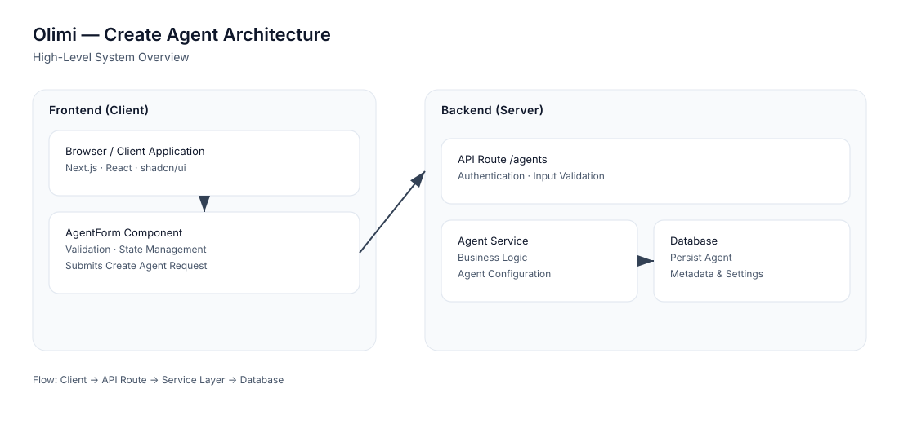

# Frontend Developer Skills Test

**CI:** GitHub Actions workflow configured — see `.github/workflows/ci.yml`.



Quick references: [API examples](docs/api_examples.md) · [Mock DB (`db.json`)](db.json)

## Overview

This project contains a **Create Agent** page from the Olimi AI dashboard. The UI is fully built but entirely static — all form dropdowns are hardcoded, file uploads don't persist, and the save/test-call buttons are non-functional.

**Your task:** Integrate the static UI with the provided mock API to make the form fully functional.

## Tech Stack

- **Next.js 16** (App Router)
- **React 19**
- **TypeScript**
- **shadcn/ui** component library
- **Tailwind CSS 4**
- **json-server** (mock API)

## Getting Started

### 1. Install dependencies

```bash
npm install
```

### 2. Set up environment

```bash
cp .env.example .env.local
```

### 3. Start the mock API server

```bash
npm run mock-api
```

This starts `json-server` at **http://localhost:3001** with routes prefixed under `/api`.

### 4. Start the Next.js development server

```bash
npm run dev
```

Open **http://localhost:3000** — you'll be redirected to the Create Agent page.

> **Note:** Both servers must be running simultaneously. Use two terminal windows/tabs.

## Project Structure

```
├── db.json                          # Mock database (json-server)
├── server/
│   ├── middleware.js                 # Custom endpoints (upload, test-call)
│   └── routes.json                  # API route mapping (/api/* → /*)
├── src/
│   ├── app/
│   │   └── (dashboard)/
│   │       ├── layout.tsx           # Dashboard layout with sidebar
            |
│   │       └── agents/
│   │           └── createAgent/
│   │               └── page.tsx     # Create Agent page
│   └── components/
│       ├── agents/
│       │   └── agent-form.tsx       # ⭐ MAIN FILE — this is where you'll work
│       ├── ui/                      # shadcn/ui components (do not modify)
│       ├── app-sidebar.tsx          # Sidebar navigation
│       ├── nav-main.tsx             # Navigation menu
│       └── nav-user.tsx             # User menu
└── .env.example                     # Environment template
```

The primary file you'll be modifying is **`src/components/agents/agent-form.tsx`**. You may create helper files (hooks, utilities, API clients) as needed.

## API Documentation

Base URL: `http://localhost:3001/api` (configured via `NEXT_PUBLIC_API_BASE_URL`)

### Reference Data Endpoints

These endpoints return static lists for populating form dropdowns.

#### GET /api/languages

Returns available languages.

```json
[
  { "id": "en", "name": "English", "code": "en" },
  { "id": "ar", "name": "Arabic", "code": "ar" },
  { "id": "fr", "name": "French", "code": "fr" }
]
```

#### GET /api/voices

Returns available voices. **Note the `tag` field** — display it as a badge next to the voice name.

```json
[
  { "id": "alloy", "name": "Alloy", "tag": "Premium", "language": "en" },
  { "id": "echo", "name": "Echo", "tag": "Standard", "language": "en" }
]
```

#### GET /api/prompts

Returns available prompt templates.

```json
[
  { "id": "default", "name": "Default Prompt", "description": "General-purpose prompt" },
  { "id": "sales", "name": "Sales Prompt", "description": "Optimized for sales" }
]
```

#### GET /api/models

Returns available AI models.

```json
[
  { "id": "pro", "name": "Pro", "description": "Highest quality, lowest latency" },
  { "id": "standard", "name": "Standard", "description": "Balanced quality and cost" }
]
```

### Agent CRUD

#### POST /api/agents

Create a new agent. Send the full form data as JSON.

**Request:**

```json
{
  "name": "Sales Assistant",
  "description": "Handles inbound sales calls",
  "callType": "inbound",
  "language": "en",
  "voice": "alloy",
  "prompt": "sales",
  "model": "pro",
  "latency": 0.5,
  "speed": 110,
  "callScript": "...",
  "serviceDescription": "...",
  "attachments": ["attachment-id-1"],
  "tools": {
    "allowHangUp": true,
    "allowCallback": false,
    "liveTransfer": false
  }
}
```

**Response** (201 Created):

```json
{
  "id": "generated-id",
  "name": "Sales Assistant",
  "...": "..."
}
```

#### PUT /api/agents/:id

Update an existing agent. Same body structure as POST.

### File Upload (3-Step Process)

Uploading a file to the agent's reference data requires three API calls:

#### Step 1: Get a signed upload URL

**POST /api/attachments/upload-url**

```json
// No body required
```

**Response:**

```json
{
  "key": "unique-file-key",
  "signedUrl": "http://localhost:3001/upload/unique-file-key",
  "expiresIn": 3600
}
```

#### Step 2: Upload the file to the signed URL

**PUT {signedUrl}**

Send the file as the request body (binary).

```
PUT http://localhost:3001/upload/unique-file-key
Content-Type: application/octet-stream

<file binary data>
```

**Response:**

```json
{
  "success": true,
  "key": "unique-file-key",
  "message": "File uploaded successfully"
}
```

#### Step 3: Register the attachment

**POST /api/attachments**

```json
{
  "key": "unique-file-key",
  "fileName": "product-catalog.pdf",
  "fileSize": 1048576,
  "mimeType": "application/pdf"
}
```

**Response** (201 Created):

```json
{
  "id": "generated-id",
  "key": "unique-file-key",
  "fileName": "product-catalog.pdf",
  "fileSize": 1048576,
  "mimeType": "application/pdf"
---
# Olimi — Create Agent (Frontend)

This repository contains a focused frontend integration project: a Create Agent page for the Olimi dashboard. The original UI was static; the work in this repo wires the UI to a mock backend so the page is fully functional for local development and evaluation.

Core capabilities implemented

- Dynamic dropdowns: languages, voices (with tags), prompts, models
- File upload: three-step signed-upload flow (request signed URL → upload → register)
- Agent CRUD: create (`POST /agents`) and update (`PUT /agents/:id`)
- Test-call flow: auto-save when needed, then `POST /agents/:id/test-call`

CI: GitHub Actions workflow is included at `.github/workflows/ci.yml`.

Diagram: `docs/architecture.svg` — high-level component and upload flow

API examples: `docs/api_examples.md`

## Tech stack

- Next.js 16 (App Router)
- React 19 + TypeScript
- Tailwind CSS 4 + shadcn/ui components
- json-server for the local mock API

## Quick start

1. Install dependencies

```bash
npm install
```

2. (Optional) copy environment template

```bash
cp .env.example .env.local
```

3. Start the mock API

```bash
npm run mock-api
```

4. Start the Next.js dev server

```bash
npm run dev
```

Open `http://localhost:3000` (the app redirects to the Create Agent page). Run `mock-api` and `dev` concurrently.

## Project layout (pointer view)

- `db.json` — mock database used by `json-server`
- `server/` — `routes.json` and `middleware.js` provide custom mock endpoints (uploads/test-calls)
- `src/app/` — layout and routing (`layout.tsx`, `page.tsx`)
- `src/components/agents/` — main UI; `agent-form.tsx` is the orchestration point; section components live in `agents-sections/`
- `src/lib/` — core logic and types:
  - [src/lib/api.tsx](src/lib/api.tsx) — centralized API helpers and orchestrators
  - [src/lib/interfaces.ts](src/lib/interfaces.ts) — TypeScript interfaces used across the UI
  - [src/lib/error.handle.ts](src/lib/error.handle.ts) — HTTP error normalization
  - [src/lib/utils.ts](src/lib/utils.ts) — validation and helpers

Other developer resources: `docs/api_examples.md`, `docs/architecture.svg`, `.github/workflows/ci.yml`.

## How the app works (concise)

- On mount, `agent-form.tsx` fetches reference data: languages, voices, prompts, models (separate loading flags for each).
- Voice list is filtered by selected language using `filterVoicesByLanguage` in `src/lib/api.tsx`.
- File uploads use a three-step process orchestrated by `src/lib/api.tsx`:
  1. `POST /attachments/upload-url` → get `{ key, signedUrl, expiresIn }`
  2. `PUT {signedUrl}` → send binary data to storage
  3. `POST /attachments` → register and receive an `id` (included in agent attachments)
- Save flow (`handleSaveAgent`): validate required fields, build payload, call `POST /agents` (or `PUT /agents/:id` when updating). The returned `id` is stored in component state.
- Test call (`handleStartTestCall`): validates test data, auto-saves agent if needed, then calls `POST /agents/:id/test-call` and surfaces status/errors.

## API summary (local)

Base URL: `http://localhost:3001/api` (default via `NEXT_PUBLIC_API_BASE_URL`). See `docs/api_examples.md` for curl examples.

- `GET /languages`
- `GET /voices`
- `GET /prompts`
- `GET /models`
- `POST /attachments/upload-url`
- `PUT {signedUrl}`
- `POST /attachments`
- `POST /agents`
- `PUT /agents/:id`
- `POST /agents/:id/test-call`

## Technical decisions (summary)

- Central API layer (`src/lib/api.tsx`) isolates HTTP, error handling and multi-step flows from UI components.
- TypeScript interfaces (`src/lib/interfaces.ts`) make API contracts explicit and improve type safety across components.
- Local component state with `useState`/`useEffect` keeps the page self-contained; presentational sections are prop-driven for reuse.
- Validation is handled client-side with `getRequiredFieldErrors` before network calls; server-side validation remains recommended for production.

## Error handling & UX

- Network errors are normalized by `ApiError` (`src/lib/error.handle.ts`) and surfaced via readable messages in the UI.
- Per-endpoint loading flags prevent invalid interactions; UI uses `ErrorAlert` and `SuccessAlert` components for feedback.
- Unsaved changes are tracked in `AgentForm` and a `beforeunload` listener prevents accidental navigation.

## Code quality notes

- Code is organized into small, focused modules (API layer, types, UI sections) for readability and testability.
- Reusable components and typed interfaces promote maintainability and reduce runtime errors.

## Where to look first

- API & orchestrators: [src/lib/api.tsx](src/lib/api.tsx)
- Types & validation: [src/lib/interfaces.ts](src/lib/interfaces.ts), [src/lib/utils.ts](src/lib/utils.ts)
- Main form: [src/components/agents/agent-form.tsx](src/components/agents/agent-form.tsx)
- Upload UI: [src/components/agents/agents-sections/reference-data-section.tsx](src/components/agents/agents-sections/reference-data-section.tsx)

## Troubleshooting

- Dropdowns empty: ensure `npm run mock-api` is running and `NEXT_PUBLIC_API_BASE_URL` points to `http://localhost:3001/api`.
- Upload failures: inspect browser console and `server/middleware.js` to understand the mock upload behavior.

## Next steps (optional)

- Add CI badge (requires repo slug)
- Open a PR with these changes
- Add automated tests (unit & integration) and extend CI to run them

If you want any of the items above I can add them next (badge, PR, tests).
