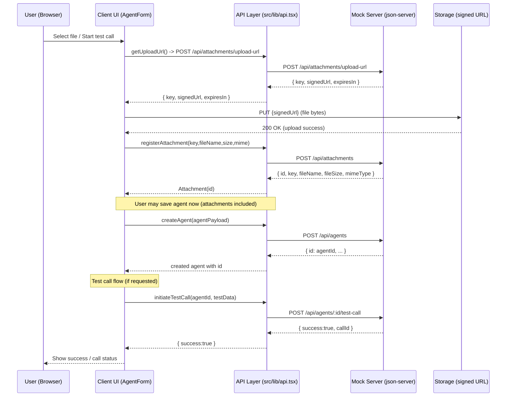

# Sequence Diagram — Upload & Test-Call Flow

This Mermaid sequence diagram shows the client-side orchestration for the 3-step file upload and the test-call workflow.

- Use a Mermaid renderer (VS Code Mermaid preview, GitHub if enabled, or mermaid-cli) to render this diagram.
